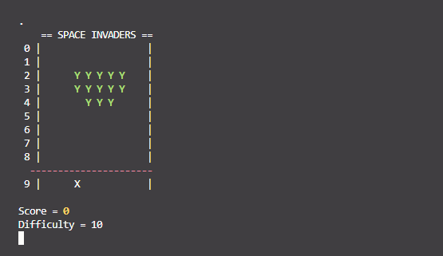
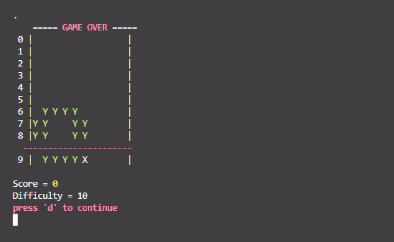

# Space-Invaders

Space Invaders done in Java-17, played entirely through the console using the 'WASD' keys.

## Controls

| In menu:        | In game:         |
| --------------- | ---------------- |
| `w` : move up   | `a` : move left  |
| `s` : move down | `d` : move right |
| `d` : select    | `s` : shoot      |

## Screenshots

Taken from the vscode build-in console.

